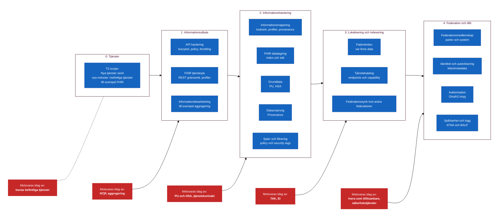

```mermaid
%%{init: {'theme': 'base', 'themeVariables': {'fontSize': '12px'}}}%%
flowchart LR

    subgraph NUVARANDE[" "]
        direction TB
        NT["Motsvaras idag av:<br/><b>Ineras befintliga tjänster</b>"]
        NU["Motsvaras idag av:<br/><b>NTjP, aggregering</b>"]
        NH["Motsvaras idag av:<br/><b>PU och HSA, tjänstekontrakt</b>"]
        NL["Motsvaras idag av:<br/><b>TAK, EI</b>"]
        NF["Motsvaras idag av:<br/><b>Inera som tillitsankare,<br/>säkerhetstjänster</b>"]

        NT ~~~ NU ~~~ NH ~~~ NL ~~~ NF
    end

    subgraph MALARKITEKTUR[" "]
        direction TB

        subgraph TJANSTER["0: Tjänster"]
            direction LR
            T0["T2-scope:<br/>Nya tjänster samt<br/>nya mönster i befintliga tjänster<br/>till exempel FHIR"]
            
        end

        subgraph UTBYTE["1: Informationsutbyte"]
            direction LR
            U1["API hantering<br/>livscykel, policy, throttling"]
            U2["FHIR tjänsteyta<br/>REST gränssnitt, profiler"]
            U34["Informationsbearbetning<br/>till exempel aggregering"]
        end

        subgraph HANTERING["2: Informationshantering"]
            direction LR
            H1["Informationsmappning<br/>kodverk, profiler, provenance"]
            H2["FHIR datalagring<br/>index och sök"]
            H3["Grunddata<br/>PU, HSA"]
            H4["Dataursprung<br/>Provenance"]
            H5["Spärr och filtrering<br/>policy och security tags"]
        end

        subgraph LOKALISERING["3: Lokalisering och indexering"]
            direction LR
            L1["Patientindex<br/>var finns data"]
            L2["Tjänstekatalog<br/>endpoints och capability"]
            L3["Federationssynk mot andra federationer"]
        end

        subgraph FEDERATION["4: Federation och tillit"]
            direction LR
            F1["Federationsmedlemskap<br/>parter och system"]
            F2["Identitet och autentisering<br/>klientmetadata"]
            F3["Auktorisation<br/>OAuth2 intyg"]
            F4["Spårbarhet och logg<br/>ATNA och BALP"]
        end

        TJANSTER --> UTBYTE
        UTBYTE --> HANTERING
        HANTERING --> LOKALISERING
        LOKALISERING --> FEDERATION
    end

    NT -.- TJANSTER
    NU -.- UTBYTE
    NH -.- HANTERING
    NL -.- LOKALISERING
    NF -.- FEDERATION

    classDef layerFill fill:#fff,color:#4A0E2E,stroke:#3A0A22
    classDef itemBlue fill:#1565C0,color:#fff,stroke:#0D47A1
    classDef noteRed fill:#C62828,color:#fff,stroke:#B71C1C
    classDef invisible fill:none,stroke:none

    class TJANSTER,UTBYTE,HANTERING,LOKALISERING,FEDERATION layerFill
    class T0,T1,T2,T3,T4 itemBlue
    class U1,U2,U34 itemBlue
    class H1,H2,H3,H4,H5 itemBlue
    class L1,L2,L3,L4 itemBlue
    class F1,F2,F3,F4,F5 itemBlue
    class NT,NU,NH,NL,NF noteRed
    class NUVARANDE,MALARKITEKTUR invisible

    %% Placera röda rutor som "kommentarer" ovanför respektive lager
    NT --> TJANSTER
    NU --> UTBYTE
    NH --> HANTERING
    NL --> LOKALISERING
    NF --> FEDERATION

    %% Gör kommentarpilar osynliga
    linkStyle 9,10,11,12,13 stroke:transparent,stroke-width:0px
```
