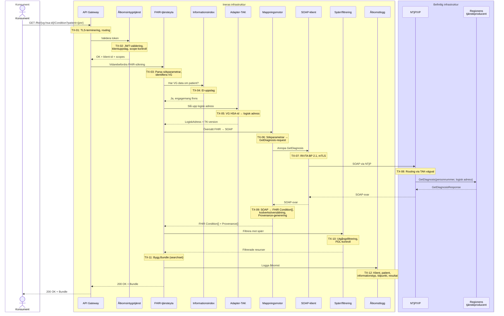
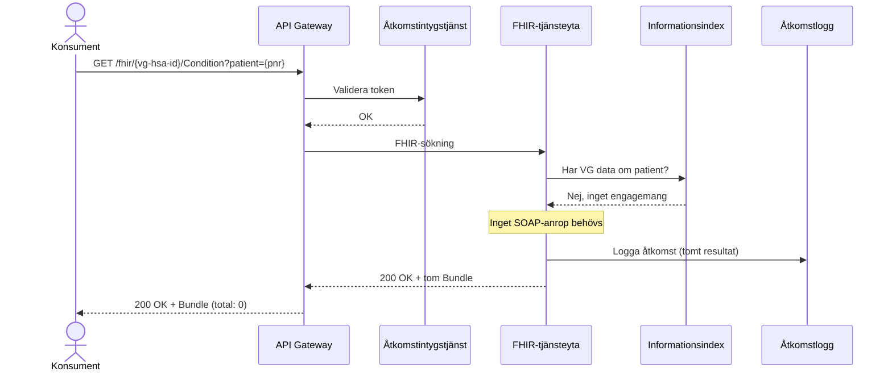
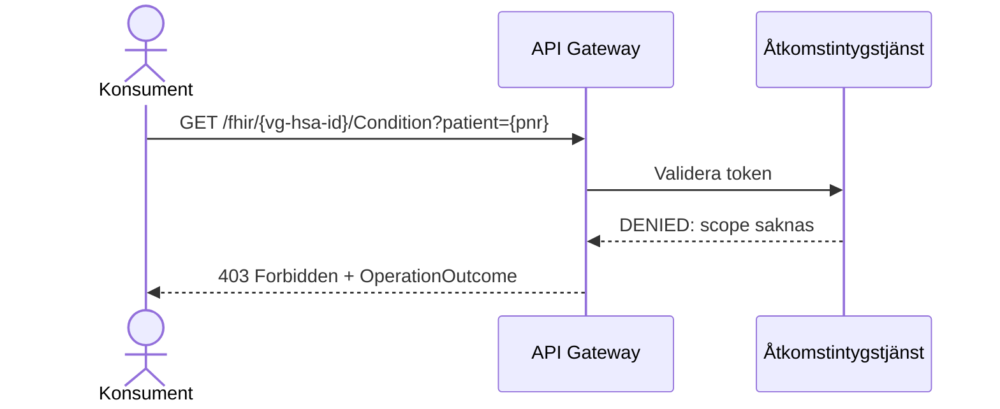
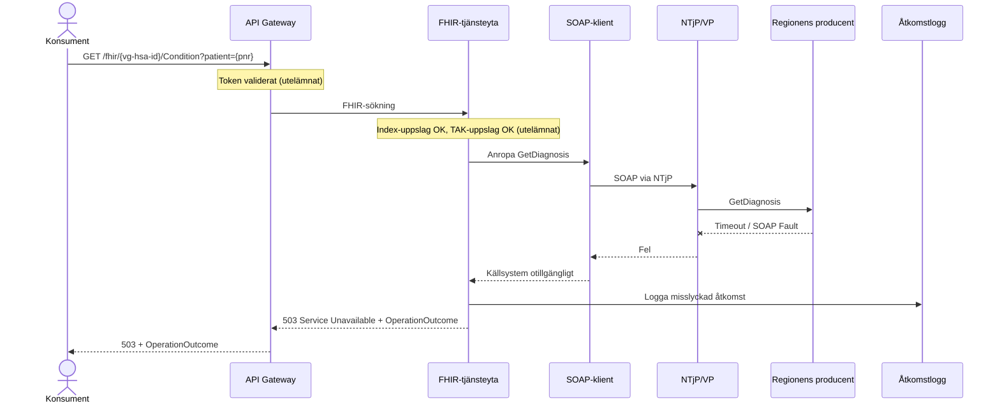
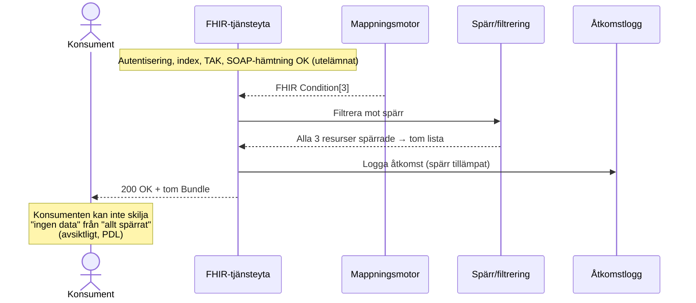
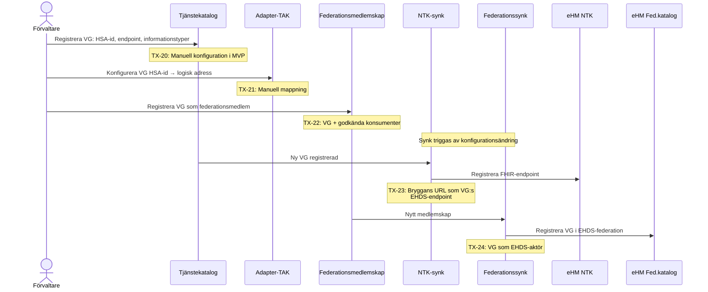
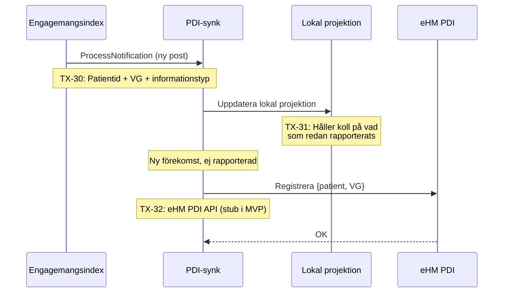
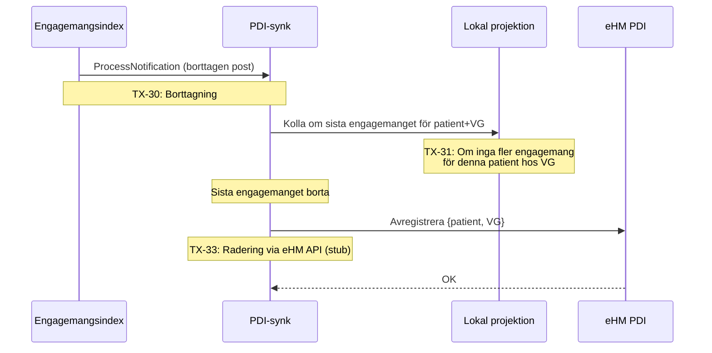
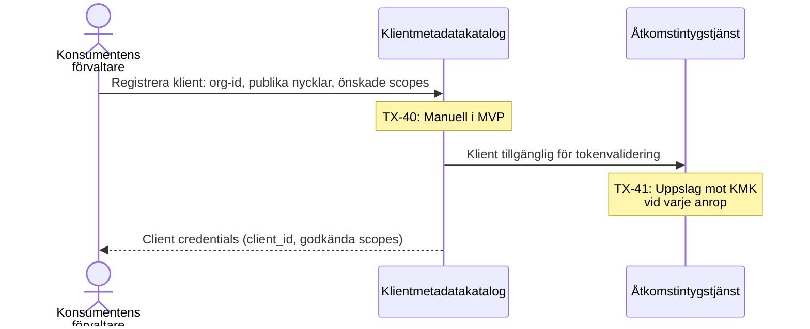

# Lösningsarkitektur: MVP EHDS-brygga

## Struktur

Dokumentet är organiserat i tre nivåer:

1. **Användningsfall (UC)** – vad en aktör vill uppnå
2. **Flöden (FL)** – sekvenser av interaktioner som realiserar användningsfallet
3. **Transaktioner (TX)** – enskilda meddelanden mellan komponenter, specbara i detalj

---

## Komponenter i MVP

| Komponent | Roll i MVP | Permanent/Övergång |
|-----------|-----------|-------------------|
| API Gateway | TLS, routing, rate limit, åtkomstkontroll | Permanent |
| Åtkomstintygstjänst | OAuth2-tokenvalidering, klientauktorisation | Permanent |
| FHIR-tjänsteyta | Logisk FHIR-server per VG, sökning, Bundle-bygge | Permanent |
| Regelverksproxy | Spärr/filtrering, åtkomstloggning, samtyckesstyrning – tillämpas på aggregerat svar innan det lämnar bryggan; kan placeras framför en VG:s native FHIR-server utan mappningslagret | Permanent |
| Informationsindex | Patientförekomst per VG (EI-baserat) | Permanent |
| Tjänstekatalog | Endpoint, informationstyper **och backend-typ (FHIR eller SOAP)** per VG | Permanent |
| Adapter-TAK | VG HSA-id → logisk adress i NTjP | Övergång |
| Mappningsmotor | FHIR↔SOAP, kodverksöversättning | Övergång (mönstret permanent) |
| SOAP-klient | RIVTA BP 2.1, mTLS, felhantering | Övergång |
| Spärr/filtrering | Utgångsfiltrering mot spärrunderlag – ingår i Regelverksproxy | Permanent (mönstret) |
| Åtkomstlogg | Loggpost per patientdataåtkomst – ingår i Regelverksproxy | Permanent |
| PDI-synk | EI → eHM:s PDI | Permanent |
| NTK-synk | Tjänstekatalog → eHM:s NTK | Permanent |
| Federationssynk | Medlemskap → eHM:s katalog | Permanent |

### Ansvarsfördelning: FHIR-tjänsteyta vs. Regelverksproxy

FHIR-tjänsteytan delas konceptuellt i två ansvarsområden med olika livslängd:

| Ansvarsområde | Innehåll | Livslängd |
|---------------|----------|-----------|
| **Mappning och orkestrering** | FHIR↔SOAP-översättning, EI-uppslag, TAK-uppslag, Bundle-bygge | Övergång – försvinner när VG:er har native FHIR |
| **Regelverksproxy** | Spärr, filtrering, åtkomstlogg, samtycke | Permanent – tillämpas oavsett om bakändan är SOAP eller FHIR |

Proxyn tillämpas alltid på det *aggregerade* svaret, d.v.s. efter att data hämtats och normaliserats från alla berörda VG:er. Det innebär att:
- Åtkomstloggen skriver **en post per konsumentanrop** (inte per VG-anrop bakom kulisserna)
- PDL-kravet "konsumenten kan inte skilja 'ingen data' från 'allt spärrat'" gäller det samlade resultatet
- `Bundle.total` och interna resursreferenser (t.ex. `Provenance.target`) uppdateras efter filtrering

---

## UC-01: Hämta diagnosinformation via FHIR

**Aktör:** Konsument (t.ex. eHM:s nationella kontaktpunkt, regional app, Ineras egen tjänst)

**Mål:** Hämta diagnosinformation (Condition) för en patient hos en vårdgivare via standard FHIR R4 REST-API.

**Förutsättningar:**
- Konsumenten är registrerad i klientmetadatakatalogen
- Konsumenten har ett giltigt OAuth2-token med scope för Condition
- Pilotregionens VG är konfigurerad i tjänstekatalogen

**Resultat:** En FHIR Bundle (searchset) med Condition-resurser, filtrerade enligt spärr, med åtkomsten loggad.

### Flöden

#### FL-01.1: Hämta diagnoser (normalflöde)

Konsument söker diagnoser för en patient hos en specifik vårdgivare. Bryggan översätter till SOAP, hämtar data, mappar till FHIR, filtrerar och returnerar.



#### FL-01.2: Patient saknar data hos VG

Konsument söker diagnoser men informationsindexet visar att VG inte har data om patienten. Inget SOAP-anrop görs.



#### FL-01.3: Konsument saknar behörighet

Konsumentens token saknar rätt scope eller är ogiltigt.



#### FL-01.4: Källsystem otillgängligt

SOAP-anropet misslyckas (timeout, fel).



#### FL-01.5: All data spärrad

SOAP-anropet lyckas men all returnerad data filtreras bort av spärrtjänsten.



### Transaktioner UC-01

| TX-id | Namn | Källa → Mål | Protokoll | In | Ut |
|-------|------|-------------|-----------|----|----|
| TX-01 | TLS-terminering och routing | Konsument → API Gateway | HTTPS | URL med VG HSA-id | Vidarebefordran till FHIR-tjänsteyta |
| TX-02 | Tokenvalidering | API Gateway → Åtkomstintygstjänst | Intern | JWT Bearer token | Klient-id, scopes, giltighet |
| TX-03 | FHIR-sökningsparsa | API Gateway → FHIR-tjänsteyta | Intern | FHIR search URL + query params | Parsade sökparametrar |
| TX-04 | Indexuppslag | FHIR-tjänsteyta → Informationsindex | Intern | VG HSA-id + personnummer | Boolean: engagemang finns/saknas |
| TX-05 | TAK-uppslag | FHIR-tjänsteyta → Adapter-TAK | Intern | VG HSA-id + informationstyp | Logisk adress + TK-version |
| TX-06 | FHIR→SOAP-översättning | FHIR-tjänsteyta → Mappningsmotor | Intern | FHIR sökparametrar | GetDiagnosis SOAP-request |
| TX-07 | SOAP-anrop | Mappningsmotor → SOAP-klient | Intern | SOAP-request + logisk adress | Svar eller felkod |
| TX-08 | NTjP-routing | SOAP-klient → NTjP/VP | SOAP/HTTPS mTLS | GetDiagnosis + logisk adress | GetDiagnosisResponse |
| TX-09 | SOAP→FHIR-översättning | SOAP-klient → Mappningsmotor | Intern | GetDiagnosisResponse | FHIR Condition[] + Provenance[] |
| TX-10 | Spärrfiltrering | FHIR-tjänsteyta → Spärr/filtrering | Intern | FHIR Condition[] + patient + konsument-kontext | Filtrerad FHIR Condition[] |
| TX-11 | Bundle-bygge | FHIR-tjänsteyta (intern) | — | Filtrerade resurser | FHIR Bundle (searchset) |
| TX-12 | Åtkomstloggning | FHIR-tjänsteyta → Åtkomstlogg | Intern/asynkron | Klient-id, patient, typ, tid, resultat | Bekräftelse |

---

## UC-02: Anslut vårdgivare till EHDS-federationen

**Aktör:** Förvaltare (Inera)

**Mål:** Registrera en ny vårdgivare så att dess diagnosinformation blir tillgänglig via FHIR-API:t och synlig i eHM:s EHDS-federation.

**Förutsättningar:**
- Avtal med regionen (TE4)
- VG:s TAK-vägval upprättat
- SITHS-certifikat konfigurerat

**Resultat:** VG:s data nåbar via FHIR, VG synlig i eHM:s register.

### Flöden

#### FL-02.1: Onboarding av pilotregion



### Transaktioner UC-02

| TX-id | Namn | Källa → Mål | Kommentar |
|-------|------|-------------|----------|
| TX-20 | Registrera VG i tjänstekatalog | Förvaltare → Tjänstekatalog | Manuell i MVP, API i framtiden |
| TX-21 | Konfigurera TAK-mappning | Förvaltare → Adapter-TAK | VG HSA-id → logisk adress + TK-version |
| TX-22 | Registrera federationsmedlem | Förvaltare → Federationsmedlemskap | VG-id, godkända scopes, konsumenter |
| TX-23 | Synka endpoint till NTK | NTK-synk → eHM NTK | FHIR-endpoint per VG (stub i MVP) |
| TX-24 | Synka medlemskap till eHM | Federationssynk → eHM Fed.katalog | VG som EHDS-aktör (stub i MVP) |

---

## UC-03: Synkronisera patientförekomst till PDI

**Aktör:** System (händelsedriven)

**Mål:** När Engagemangsindex uppdateras med ny patientförekomst hos en VG, rapportera detta till eHM:s PDI så att internationella konsumenter kan hitta data.

**Trigger:** EI ProcessNotification – ny eller borttagen post.

### Flöden

#### FL-03.1: Ny patientförekomst



#### FL-03.2: Borttagen patientförekomst



### Transaktioner UC-03

| TX-id | Namn | Källa → Mål | Kommentar |
|-------|------|-------------|----------|
| TX-30 | EI-notifikation | EI → PDI-synk | ProcessNotification: CUD-operation per engagemang |
| TX-31 | Projektionsuppdatering | PDI-synk → Lokal projektion | Intern state: vad är rapporterat till PDI |
| TX-32 | Registrera patientförekomst | PDI-synk → eHM PDI | {patient, VG} – stub i MVP |
| TX-33 | Avregistrera patientförekomst | PDI-synk → eHM PDI | Radering – stub i MVP |

---

## UC-04: Registrera konsument

**Aktör:** Konsumentens förvaltare

**Mål:** Registrera en ny konsument (klient) så den kan anropa FHIR-API:t.

### Flöden

#### FL-04.1: Konsumentregistrering



### Transaktioner UC-04

| TX-id | Namn | Källa → Mål | Kommentar |
|-------|------|-------------|----------|
| TX-40 | Registrera klient | Förvaltare → Klientmetadatakatalog | Ansvarig part, nycklar, scopes |
| TX-41 | Klientuppslag | Åtkomstintygstjänst → Klientmetadatakatalog | Vid tokenvalidering |

---

## Transaktionsspecifikation: TX-06 FHIR→SOAP-översättning (exempel)

Nedan exemplifieras detaljnivån för en enskild transaktion. Samma format kan användas för alla TX.

### Identitet
- **TX-id:** TX-06
- **Namn:** FHIR→SOAP-översättning (Condition → GetDiagnosis)
- **Feature:** F1.2 Mappningsmotor

### In
FHIR sökparametrar (parsade):

| FHIR-parameter | Typ | Exempel |
|----------------|-----|---------|
| patient | reference/identifier | `patient=http://electronichealth.se/identifier/personnummer\|191212121212` |
| category | token | `category=encounter-diagnosis` |
| code | token | `code=http://hl7.org/fhir/sid/icd-10-se\|E11` |
| onset-date | date | `onset-date=ge2024-01-01` |
| clinical-status | token | `clinical-status=active` |

### Mappningsregler

| FHIR-parameter | → | SOAP-element | Regel |
|----------------|---|-------------|-------|
| patient (personnummer) | → | `<person-id extension="191212121212" root="1.2.752.129.2.1.3.1"/>` | OID för personnummer |
| category | → | (post-query filtering) | TK stöder ej category-filter; filtrera efter hämtning |
| code | → | (post-query filtering) | TK returnerar alla diagnoser; filtrera på code |
| onset-date | → | `<tidperiod><start>20240101</start></tidperiod>` | Konvertera FHIR-datumprefix till TK-tidperiod |
| clinical-status | → | (post-query filtering) | TK saknar statusfilter |

### Ut
GetDiagnosis SOAP-request:

```xml
<GetDiagnosis xmlns="urn:riv:clinicalprocess:healthcond:description:GetDiagnosisResponder:1">
  <person-id extension="191212121212" root="1.2.752.129.2.1.3.1"/>
  <tidperiod>
    <start>20240101</start>
  </tidperiod>
</GetDiagnosis>
```

### Felhantering
- Saknad obligatorisk parameter (patient): returnera 400 + OperationOutcome innan SOAP-anrop
- Ogiltigt personnummer-format: returnera 400 + OperationOutcome

---

## Transaktionsspecifikation: TX-09 SOAP→FHIR-översättning (exempel)

### Identitet
- **TX-id:** TX-09
- **Namn:** SOAP→FHIR-översättning (GetDiagnosisResponse → Condition[])
- **Feature:** F1.2 Mappningsmotor

### In
GetDiagnosisResponse med diagnos-poster.

### Mappningsregler per diagnos

| SOAP-element | → | FHIR-attribut | Regel |
|-------------|---|---------------|-------|
| `diagnos/diagnosKod/@code` | → | `Condition.code.coding[0].code` | Direkt |
| `diagnos/diagnosKod/@codeSystem` | → | `Condition.code.coding[0].system` | OID → URI: `1.2.752.116.1.1.1.1.3` → `http://hl7.org/fhir/sid/icd-10-se` |
| `diagnos/diagnosKod/@displayName` | → | `Condition.code.coding[0].display` | Direkt |
| `diagnos/beskrivning` | → | `Condition.code.text` | Fritext |
| `diagnos/diagnosTidpunkt` | → | `Condition.onsetDateTime` | `yyyyMMdd` → `yyyy-MM-dd` |
| `diagnos/typ` | → | `Condition.category` | Mappningstabell: `huvuddiagnos` → encounter-diagnosis |
| `diagnos/status` | → | `Condition.clinicalStatus` | Mappningstabell |
| `diagnos/registreringsEnhet/enhets-id` | → | `Condition.encounter.performer` → `Organization` | `Reference(Organization/{HSA-id})` |
| (metadata) | → | `Condition.meta.source` | Bryggans identifierare + TK-version |
| (per diagnos) | → | `Provenance.target` | Referens till Condition |
| (per diagnos) | → | `Provenance.agent.who` | Referens till producerande organisation |
| (fast) | → | `Provenance.activity` | `#derivation` (transformerad data) |

### Ut
Array av FHIR Condition + matchande Provenance-resurser.

### Felhantering
- SOAP-svar med tekniskt fel: logga, returnera OperationOutcome
- Diagnos saknar obligatoriskt fält (t.ex. diagnosKod): hoppa över diagnosen, logga varning
- Okänt kodverk-OID: inkludera med OID som system-URI, logga

---

## Sammanfattning: UC → FL → TX

```
UC-01: Hämta diagnoser via FHIR
├── FL-01.1: Normalflöde                    TX-01..TX-12
├── FL-01.2: Patient saknar data            TX-01..TX-04, TX-12
├── FL-01.3: Konsument saknar behörighet    TX-01..TX-02
├── FL-01.4: Källsystem otillgängligt       TX-01..TX-09 (fel), TX-12
└── FL-01.5: All data spärrad              TX-01..TX-10, TX-12

UC-02: Anslut VG till federationen
└── FL-02.1: Onboarding                    TX-20..TX-24

UC-03: Synka patientförekomst till PDI
├── FL-03.1: Ny förekomst                  TX-30..TX-32
└── FL-03.2: Borttagen förekomst           TX-30, TX-31, TX-33

UC-04: Registrera konsument
└── FL-04.1: Konsumentregistrering         TX-40..TX-41
```

---

## Öppen fråga: CapabilityStatement-hämtning

Ska `GET /fhir/{vg-hsa-id}/metadata` vara ett eget användningsfall (UC-05) eller ett flöde under UC-01? Det är en transaktion utan patientdata (ingen spärr, ingen logg) men behöver tokenvalidering. Förslag: eget flöde FL-01.6 under UC-01.

## Öppen fråga: Aggregering

Sekvensdiagrammet i den bifogade bilden visar en aggregeringsmodell där 1177/Journalen hämtar data från multipla VG:er parallellt (via index → parallella hämtningar). MVP:n täcker en VG i taget, men designen bör vara förberedd för ett framtida UC-05: "Hämta diagnosinformation från alla VG:er med data om en patient" – vilket kräver tvärsökning via informationsindex + parallella anrop, samma mönster som AgP idag fast med FHIR som utgående format.

### Designprinciper för UC-05 att ha med sig redan nu

**Utåt ser lösningen ut som en VG:s FHIR-server.** Konsumenten anropar ett FHIR-API med ett VG HSA-id i URL:en. I aggregeringsfallet kan det HSA-id:t tillhöra bryggan/Inera snarare än en enskild region – konsumenten behöver inte känna till om svaret aggregerats.

**URL-mönster för aggregering** (förslag):
- Per VG (MVP): `GET /fhir/{vg-hsa-id}/Condition?patient={pnr}`
- Aggregerat (UC-05): `GET /fhir/{inera-aggregator-hsa-id}/Condition?patient={pnr}`

**Tjänstekatalog måste hålla backend-typ.** När bryggan i UC-05 slår upp vilka VG:er som har data (via EI) och sedan ska hämta den, behöver den veta om respektive VG exponerar FHIR eller SOAP. Tjänstekatalogen behöver därför innehålla `backendTyp: FHIR | SOAP` per VG-endpoint, så att bryggan kan välja rätt adapter.

**Regelverksproxyn tillämpas en gång på det aggregerade resultatet** – inte per VG-anrop. Annars riskerar man:
- Flera loggposter för samma konsumentanrop
- Inkonsekvent filtrering om spärr täcker data från flera VG:er

**Deduplicering** av resurser som förekommer hos flera VG:er bör adresseras i UC-05-specen (t.ex. samma diagnos registrerad i två system).
