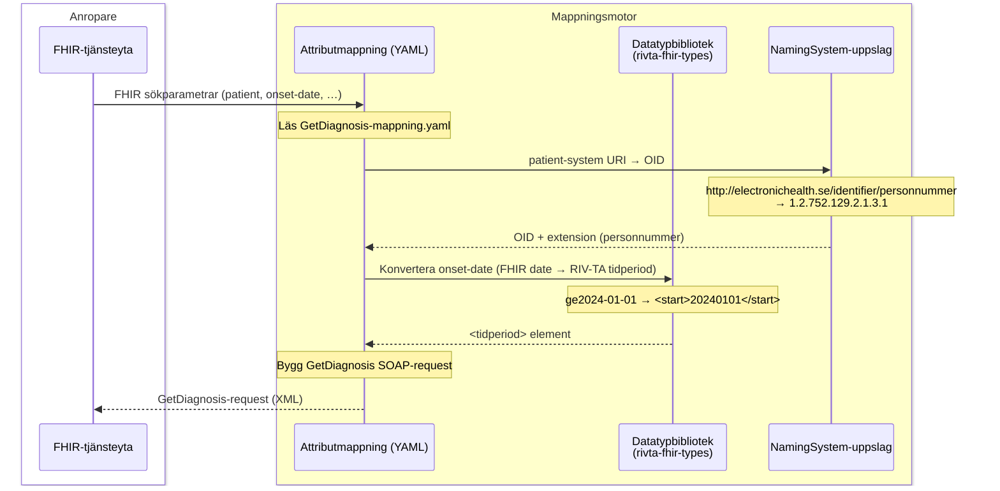
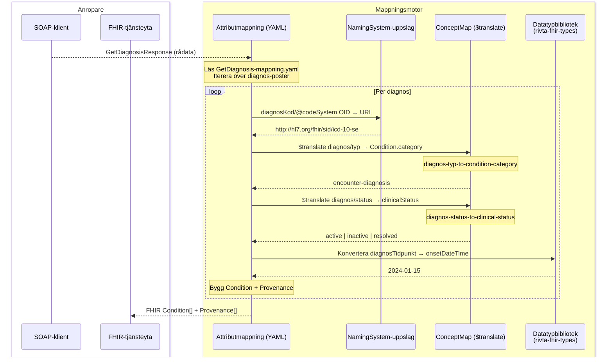

# Mappningsarkitektur: FHIR↔SOAP

Detaljering av TX-06 (FHIR→SOAP) och TX-09 (SOAP→FHIR) i [lösningsarkitekturen](losningsarkitektur-mvp-ehds.md).

---

## Tre-lagers-modell

Mappningen är uppdelad i tre lager med tydlig separation of concerns:

```
┌─────────────────────────────────────────────────────────┐
│  Lager 3: Attributmappning per TK (YAML)                │
│  GetDiagnosis-mappning.yaml                             │
│  SOAP-element ↔ FHIR-attribut, anropar lager 1 & 2     │
├────────────────────────────┬────────────────────────────┤
│  Lager 2a: NamingSystem    │  Lager 2b: ConceptMap      │
│  OID ↔ URI                 │  kod → kod ($translate)    │
│  Identifierarsystem        │  Kodverksöversättning      │
│  & kodsystem               │                            │
├────────────────────────────┴────────────────────────────┤
│  Lager 1: Datatypbibliotek (rivta-fhir-types)           │
│  RIV-TA-datatyper → FHIR-datatyper                      │
│  Datum, tidperiod, personnummer, HSA-id, …              │
└─────────────────────────────────────────────────────────┘
```

### Lager 1: Datatypbibliotek (rivta-fhir-types)

Återanvändbart bibliotek för RIV-TA ↔ FHIR datatypkonvertering. Anropas av lager 3 och känner inte till specifika tjänstekontraktens semantik.

| Konvertering | RIV-TA-typ | FHIR-typ | Regel |
|---|---|---|---|
| Datum | `yyyyMMdd` (string) | `date` (`yyyy-MM-dd`) | Infoga bindestreck |
| Datum+tid | `yyyyMMddHHmmss` | `dateTime` | ISO 8601 |
| Tidperiod | `<tidperiod><start>` / `<slut>` | `Period.start` / `end` | Via datumkonvertering |
| Personnummer | `<person-id extension="…" root="OID">` | `Patient.identifier` (via NamingSystem) | OID-uppslag i lager 2a |
| HSA-id | `<enhets-id extension="…" root="OID">` | `Organization.identifier` | OID-uppslag i lager 2a |
| Fritext | `xsd:string` | `string` | Direkt |

### Lager 2a: NamingSystem

FHIR `NamingSystem`-resurser som håller regeln för OID ↔ URI-översättning. Hanterar **bådaidentifierarsystem** (personnummer, HSA-id) och **kodsystem** (ICD-10-SE, KVÅ, …).

> **Viktigt:** HAPI FHIR `$translate` hanterar *inte* systemöversättning – det är NamingSystem-lagrets ansvar.

| OID | URI | Typ |
|---|---|---|
| `1.2.752.129.2.1.3.1` | `http://electronichealth.se/identifier/personnummer` | Identifierarsystem |
| `1.2.752.129.2.1.4.1` | `https://www.riv.se/infrastructure/technical/frameworks/infrastructure-concepts/hsa-id` | Identifierarsystem |
| `1.2.752.116.1.1.1.1.3` | `http://hl7.org/fhir/sid/icd-10-se` | Kodsystem |
| `1.2.752.116.2.21` | `http://snomed.info/sct` | Kodsystem |
| `1.2.752.129.2.2.2.1` | `http://electronichealth.se/id/kva` | Kodsystem |

### Lager 2b: ConceptMap

FHIR `ConceptMap`-resurser för **kod → kod**-översättning mellan RIV-TA-kodsystem och FHIR-kodsystem. Anropas via `$translate`.

| ConceptMap | Källkodsystem | Målkodsystem | Exempel |
|---|---|---|---|
| `diagnos-typ-to-condition-category` | RIV-TA diagnos/typ | `http://terminology.hl7.org/CodeSystem/condition-category` | `huvuddiagnos` → `encounter-diagnosis` |
| `diagnos-status-to-clinical-status` | RIV-TA diagnos/status | `http://terminology.hl7.org/CodeSystem/condition-clinical` | `aktuell` → `active` |

### Lager 3: Attributmappning per TK (YAML)

En YAML-fil per tjänstekontrakt som specificerar vilka SOAP-element som mappas till vilka FHIR-attribut, och vilka lager 1/2-funktioner som anropas. Hålls i versionshanterat repo och utgör den primära artefakten för förvaltning av mappningsreglerna.

**Exempel: `GetDiagnosis-mappning.yaml` (utdrag)**

```yaml
tjänstekontrakt: GetDiagnosis:1
riktning: soap-to-fhir
målresurs: Condition

attribut:
  - soap: diagnos/diagnosKod/@code
    fhir: Condition.code.coding[0].code
    transform: direkt

  - soap: diagnos/diagnosKod/@codeSystem
    fhir: Condition.code.coding[0].system
    transform: naming-system-oid-to-uri   # Lager 2a

  - soap: diagnos/diagnosTidpunkt
    fhir: Condition.onsetDateTime
    transform: rivta-date-to-fhir         # Lager 1

  - soap: diagnos/typ
    fhir: Condition.category
    transform: concept-map                # Lager 2b
    conceptMap: diagnos-typ-to-condition-category

  - soap: diagnos/status
    fhir: Condition.clinicalStatus
    transform: concept-map                # Lager 2b
    conceptMap: diagnos-status-to-clinical-status
```

---

## FL-M-01: FHIR→SOAP mappning (TX-06, internt)

Detaljering av vad som sker inuti mappningsmotorn vid TX-06. FL-01.1 visar TX-06 som ett enstaka steg – det här diagrammet förklarar internflödet.



**Parametrar som ej kan översättas till SOAP** (category, code, clinical-status) flaggas för post-query-filtrering och skickas tillbaka till FHIR-tjänsteytan som filterpredikat.

---

## FL-M-02: SOAP→FHIR mappning (TX-09, internt)

Detaljering av vad som sker inuti mappningsmotorn vid TX-09.



---

## Transaktionsspecifikation TX-06 (FHIR→SOAP)

### Identitet
- **TX-id:** TX-06
- **Namn:** FHIR→SOAP-översättning (Condition-sökning → GetDiagnosis-request)
- **Komponent:** Mappningsmotor
- **Artefakt:** `GetDiagnosis-mappning.yaml` + NamingSystem-resurser + datatypbibliotek

### Indata

| FHIR-parameter | Typ | Exempel |
|---|---|---|
| `patient` | reference/identifier | `patient=http://electronichealth.se/identifier/personnummer\|191212121212` |
| `onset-date` | date (prefix) | `onset-date=ge2024-01-01` |
| `category` | token | `category=encounter-diagnosis` *(post-query-filter)* |
| `code` | token | `code=http://hl7.org/fhir/sid/icd-10-se\|E11` *(post-query-filter)* |
| `clinical-status` | token | `clinical-status=active` *(post-query-filter)* |

### Steg och ansvarig artefakt

| Steg | Beskrivning | Artefakt |
|---|---|---|
| 1 | Validera att `patient` är angiven och har giltigt format | Attributmappning (YAML) |
| 2 | Slå upp patient-systemets URI → OID | NamingSystem (lager 2a) |
| 3 | Konvertera `onset-date` datumprefix → RIV-TA `<tidperiod>` | Datatypbibliotek (lager 1) |
| 4 | Identifiera parametrar utan SOAP-motsvarighet → post-query-filter | Attributmappning (YAML) |
| 5 | Bygg `GetDiagnosis` SOAP-request | Attributmappning (YAML) |

### Utdata
`GetDiagnosis` SOAP-request:

```xml
<GetDiagnosis xmlns="urn:riv:clinicalprocess:healthcond:description:GetDiagnosisResponder:1">
  <person-id extension="191212121212" root="1.2.752.129.2.1.3.1"/>
  <tidperiod>
    <start>20240101</start>
  </tidperiod>
</GetDiagnosis>
```

Separat: lista av filterpredikat för post-query-filtrering (category, code, clinical-status).

### Felhantering
- Saknad `patient`-parameter: returnera 400 + OperationOutcome, inget SOAP-anrop
- Ogiltigt personnummer-format: returnera 400 + OperationOutcome
- Okänt patient-system (URI ej i NamingSystem): returnera 400 + OperationOutcome

---

## Transaktionsspecifikation TX-09 (SOAP→FHIR)

### Identitet
- **TX-id:** TX-09
- **Namn:** SOAP→FHIR-översättning (GetDiagnosisResponse → Condition[])
- **Komponent:** Mappningsmotor
- **Artefakt:** `GetDiagnosis-mappning.yaml` + NamingSystem + ConceptMap + datatypbibliotek

### Steg och ansvarig artefakt

| Steg | Beskrivning | Artefakt |
|---|---|---|
| 1 | Iterera diagnos-poster i GetDiagnosisResponse | Attributmappning (YAML) |
| 2 | Översätt `diagnosKod/@codeSystem` OID → URI | NamingSystem (lager 2a) |
| 3 | Översätt `diagnos/typ` → `Condition.category` | ConceptMap (lager 2b) |
| 4 | Översätt `diagnos/status` → `Condition.clinicalStatus` | ConceptMap (lager 2b) |
| 5 | Konvertera `diagnosTidpunkt` → `onsetDateTime` | Datatypbibliotek (lager 1) |
| 6 | Mappa `enhets-id` OID → Organization-identifier URI | NamingSystem (lager 2a) |
| 7 | Generera `Provenance` per Condition | Attributmappning (YAML) |
| 8 | Applicera post-query-filter (category, code, clinical-status) | FHIR-tjänsteyta |

### Mappningsregler per SOAP-element

| SOAP-element | FHIR-attribut | Artefakt | Regel |
|---|---|---|---|
| `diagnos/diagnosKod/@code` | `Condition.code.coding[0].code` | Direkt | — |
| `diagnos/diagnosKod/@codeSystem` | `Condition.code.coding[0].system` | NamingSystem | OID → URI |
| `diagnos/diagnosKod/@displayName` | `Condition.code.coding[0].display` | Direkt | — |
| `diagnos/beskrivning` | `Condition.code.text` | Direkt | Fritext |
| `diagnos/diagnosTidpunkt` | `Condition.onsetDateTime` | Datatypbibliotek | `yyyyMMdd` → `yyyy-MM-dd` |
| `diagnos/typ` | `Condition.category` | ConceptMap | `huvuddiagnos` → `encounter-diagnosis` |
| `diagnos/status` | `Condition.clinicalStatus` | ConceptMap | `aktuell` → `active` |
| `diagnos/registreringsEnhet/enhets-id` | `Condition.encounter.performer` → Organization | NamingSystem | OID → URI, `Reference(Organization/{HSA-id})` |
| *(metadata)* | `Condition.meta.source` | Attributmappning | Bryggans identifierare + TK-version |
| *(per diagnos)* | `Provenance.target` | Attributmappning | Referens till Condition |
| *(per diagnos)* | `Provenance.agent.who` | Attributmappning | Referens till producerande organisation |
| *(fast)* | `Provenance.activity` | Attributmappning | `#derivation` |

### Felhantering
- SOAP-svar med tekniskt fel: logga, returnera OperationOutcome
- Diagnos saknar `diagnosKod`: hoppa över diagnosen, logga varning
- OID ej i NamingSystem: inkludera med OID som system-URI, logga varning
- `$translate` returnerar ingen mappning: inkludera originalkod, logga varning
